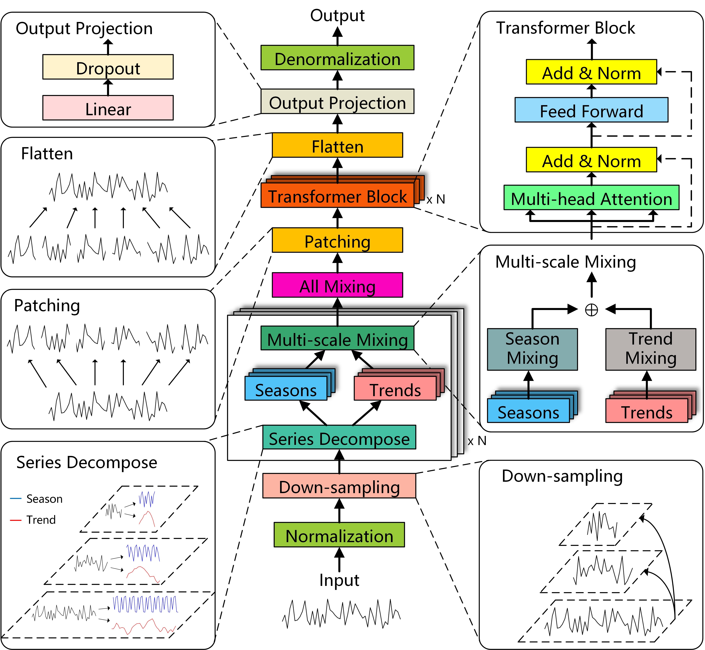

# DSPNet: A Transformer Network Based on Multi-Scale Feature Modeling and Patch Representation for Long-Term Multivariate Time Series Forecasting

## Description 
This repository provides the official implementation of **DSPNet**, a deep learning framework for long-term multivariate time series forecasting. The project includes source code, datasets, and experimental scripts for reproducing the results reported in our research. DSPNet introduces a multi-scale modeling approach and uses patch representations, combined with a Transformer-based architecture, to effectively capture more comprehensive multi-scale temporal dependencies. This repository allows researchers and practitioners to: - Reproduce experimental results on benchmark datasets. - Apply DSPNet to their own multivariate time series forecasting tasks. - Extend or adjust the architecture for applications related to AI and data-driven modeling.


## Methodology

The proposed DSPNet model follows the workflow illustrated below:



**Workflow:**
1. Data preprocessing: normalize raw time series and construct input-output windows.
2. Multi-scale Modeling: Leveraging down-sampling and trend-seasonal decomposition to capture patterns at multiple temporal scales.
3. Patch Representation: By segmenting long sequences into manageable patches, the model achieves higher computational efficiency, enhanced local feature extraction, while preserving global temporal trends.
4. Transformer Architecture: Performs global feature extraction on patch-based time series data.
5. Output layer: long-term forecasting predictions.


## Dataset Information

This project uses multiple publicly available benchmark datasets for long-term time series forecasting:

- **ETTh/ETTm** ([ETDataset](https://github.com/zhouhaoyi/ETDataset)):  
  Electricity Transformer Temperature datasets collected from two stations. ETTh represents hourly data, while ETTm represents 15-minute data. Each dataset records load and oil temperature, providing multivariate time series with strong periodicity and long-term dependencies.  

- **Electricity** ([UCI Repository](https://archive.ics.uci.edu/ml/datasets/ElectricityLoadDiagrams20112014)):  
  Electricity consumption data from 321 clients between 2011 and 2014. The dataset is widely used for multivariate forecasting tasks.  

- **Traffic** ([DCRNN Dataset](https://github.com/liyaguang/DCRNN)):  
  Road occupancy rates measured by 862 sensors located on San Francisco freeways in 2015. This dataset reflects complex traffic flow patterns with strong temporal dependencies.  

- **Weather** ([NOAA National Centers for Environmental Information](https://www.ncei.noaa.gov)):  
  Meteorological data including temperature, humidity, wind speed, and other variables. This dataset captures environmental dynamics and seasonal variations.  

**Data Preprocessing:**  
- Normalization is applied to all datasets before training.  
- A sliding window method is used to construct input sequences and forecast horizons.  
- Training/validation/test splits follow standard settings from prior studies to ensure fair comparison.  

**Availability:**  
- Raw datasets can be downloaded from the links above.  

## Code Information

### Directory Structure
- `data_provider/` : Load and preprocess datasets (normalization, sliding window).
- `dataset/` : Dataset storage location
- `exp/` : folder contains scripts and modules for training, validation, and testing of the DSPNet model.
- `models/` : Implementation of DSPNet and baseline models.
- `layers/` : Core network modules (attention, patch embedding, feed-forward layers).
- `utils/` : Helper functions (metrics, visualization, logging).
- `scripts/` : Shell scripts to train and evaluate DSPNet on different datasets.
- `run_longExp.py': Script for running long-term time series forecasting experiments, supporting multiple datasets, prediction lengths, and configurations. It manages training, validation, testing, and result saving for comprehensive evaluation.

## Dependencies
- Python 3.8+
- PyTorch 1.11.0
- numpy, pandas, scikit-learn, matplotlib
  
Dependencies can also be quickly installed with:
```bash
pip install -r requirements.txt
```
## Usage
1. Prepare datasets in `./dataset/` folder.
2. Run training script (example for ETTh1 dataset):
```bash
bash ./scripts/DSPNet/etth1.sh
```
## Citations

If you use this code or datasets in your research, please cite the corresponding sources:

**Datasets:**
- ETTh/ETTm: Chen et al., "ETDataset: A collection of electricity transformer temperature datasets", GitHub: https://github.com/zhouhaoyi/ETDataset
- Electricity: UCI Machine Learning Repository, "ElectricityLoadDiagrams20112014", https://archive.ics.uci.edu/ml/datasets/ElectricityLoadDiagrams20112014
- Traffic: Li et al., "DCRNN: Diffusion Convolutional Recurrent Neural Network for Traffic Forecasting", GitHub: https://github.com/liyaguang/DCRNN
- Weather: NOAA National Centers for Environmental Information, https://www.ncei.noaa.gov

**Code:**
- DSPNet repository: Liang et al., "DSPNet: A Transformer Network Based on Multi-Scale Feature Modeling and Patch Representation for Long-Term Multivariate Time Series Forecasting" (under review), GitHub: https://github.com/jk16171216/DSPNet

## License

This project is licensed under the MIT License. See the [LICENSE](LICENSE) file for details.


